# GitOps MCP Server

A local, read-only Git inspection server for the [Model Context Protocol](https://modelcontextprotocol.io). It exposes
status, history, diffs, blame, and search as typed tools that return JSON, so an assistant doesn't have to drive `git`
through a shell.

The server runs `git` for you in a subprocess and returns parsed results. Only git's read/inspect subcommands are
wired up, so the assistant can't mutate your repository through this server.

---

## Why use it?

| Without this server                                         | With this server                                      |
|-------------------------------------------------------------|-------------------------------------------------------|
| Assistant runs `git` through a shell (`Bash`/`run_command`) | Assistant calls typed tools with named parameters     |
| Output is raw text the model has to re-parse                | Output is JSON in a consistent envelope               |
| A bad argument could mutate or corrupt the repo             | Only inspection subcommands exist                     |
| Paths and refs flow straight to the shell                   | Paths are confined to the repo; refs are pre-verified |
| No limits on runtime or output size                         | 30 s timeout and 8 MB output cap on every call        |
| Hard to tell "no results" from "command failed"             | Distinct error codes for each failure mode            |

### What's in the toolset

`status`, `diff`, `log`, `show`, `blame`, `grep`, `ls-files`, `branch list`, `reflog`, and `stash` inspection.
There's no `commit`, `push`, `checkout`, `reset`, or any other writing subcommand aren't implemented.

Collection-returning tools wrap their payload in a uniform [result envelope](#the-result-envelope) carrying `count`,
`filters_applied`, `truncated`, `repo_root`, and (on failure) a structured `error`. The assistant can act on a
response without re-issuing the command to figure out what happened.

Argument handling is centralized. Tools declare a typed intent; one builder turns that intent into argv with a fixed
hardening prefix, an `--end-of-options` barrier, a scrubbed environment, and repo-confined pathspecs. See
[Security model](#security-model).

Every tool takes an absolute `cwd`. The server resolves the repo root via `git rev-parse --show-toplevel` (cached per
`cwd`), so the assistant doesn't need to know the repo layout.

---

## How a call works

Every tool runs through the same pipeline. The only things that change are which git subcommand fires and how the
output gets parsed.

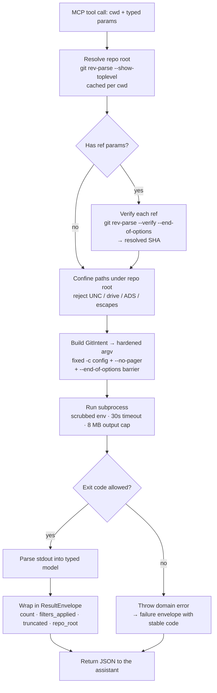

A few rules apply to every call regardless of tool:

- **Timeout**: 30 s wall-clock. If the subprocess runs longer, the process tree is killed and a `GitTimeout` error is
  returned.
- **Output cap**: 8 MB per stream, truncate-then-flag. Oversized output sets `truncated: true` on the envelope instead
  of blowing up memory.
- **stdout protection**: a sentinel guards the stdio transport so stray writes can't corrupt the MCP protocol stream.
  All logging goes to a file or stderr.

---

## Tool catalog

| Tool                                  | Purpose                                                   | Key parameters                                                                             |
|---------------------------------------|-----------------------------------------------------------|--------------------------------------------------------------------------------------------|
| [`git_status`](#git_status)           | Working-tree status snapshot                              | `cwd`                                                                                      |
| [`git_diff`](#git_diff)               | Unified diff (staged / ref-to-ref / worktree / stat-only) | `cwd`, `staged`, `fromRef`, `toRef`, `paths`, `contextLines`, `statOnly`                   |
| [`git_log`](#git_log)                 | Commit history with filters                               | `cwd`, `paths`, `author`, `since`, `until`, `grep`, `pickaxe`, `maxCount`, `ref`, `follow` |
| [`git_show`](#git_show)               | Inspect one commit/tag/tree + its diffs                   | `cwd`, `ref`, `paths`                                                                      |
| [`git_blame`](#git_blame)             | Per-line author/commit/time for a file                    | `cwd`, `path`, `lineStart`, `lineEnd`, `ref`                                               |
| [`git_grep`](#git_grep)               | Search tracked content (optionally at a ref)              | `cwd`, `pattern`, `paths`, `ref`, `ignoreCase`, `fixedString`, `maxCount`                  |
| [`git_ls_files`](#git_ls_files)       | List tracked paths                                        | `cwd`, `paths`                                                                             |
| [`git_branch_list`](#git_branch_list) | List local (and optionally remote) branches               | `cwd`, `includeRemote`                                                                     |
| [`git_reflog`](#git_reflog)           | Recent reflog entries                                     | `cwd`, `maxCount`                                                                          |
| [`git_stash_list`](#git_stash_list)   | List stash entries                                        | `cwd`                                                                                      |
| [`git_stash_show`](#git_stash_show)   | Diff for a single stash entry                             | `cwd`, `index`                                                                             |

---

## Tool details

### `git_status`

Returns a working-tree snapshot built from porcelain v2 with `-z` (NUL-delimited) output, plus branch and ahead/behind
information. The result is parsed from a known format rather than scraped from human-readable text.

The payload groups changes into `staged`, `unstaged`, and `untracked` lists and includes `branch`, `upstream`, `ahead`,
`behind`, and an `is_clean` flag.

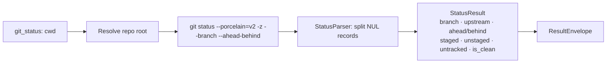

---

### `git_diff`

Returns a unified diff in one of four modes, picked by the parameters you pass (precedence:
`stat_only` > `ref_to_ref` > `staged` > `worktree`):

- **worktree**: unstaged changes (default)
- **staged**: index vs `HEAD` (`staged: true` adds `--cached`)
- **ref_to_ref**: `fromRef` to `toRef` (any branch/tag/SHA; `toRef` defaults to the working tree)
- **stat_only**: per-file add/delete counts and change kind, no patch text

Each diff runs two passes: the patch itself (or `--name-status` for stat-only) and a companion `--numstat -z` pass.
The two are merged into one `DiffResult` so every file carries both its hunks and its line counts. `contextLines`
maps to git's `-U<n>`.

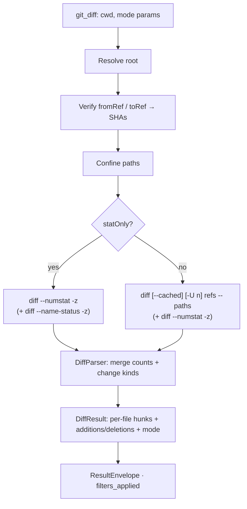

---

### `git_log`

Returns commits matching the given filters, parsed from a fixed `--pretty=format` directive into `Commit` records
(hash, short hash, author, authored/committed timestamps, relative time, subject, body, parents).

Filters: `author`, `since`, `until`, `grep` (message match), `pickaxe` (`-S`, find when a string was added or
removed), `paths`, `ref` (start point), `follow` (track renames, only when scoped to a single path), and `maxCount`
(default 50).

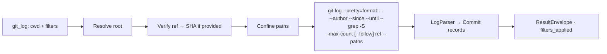

---

### `git_show`

Inspects a single ref (commit, tag, or tree) and returns its metadata along with per-file diffs. The ref is required
and is verified to a SHA before use.

Runs two passes: a one-commit `git log` for metadata (same format as `git_log`), and `git show --format=` for the
patch, parsed into the same `FileDiff` shape as `git_diff`. `paths` restricts the diff section.

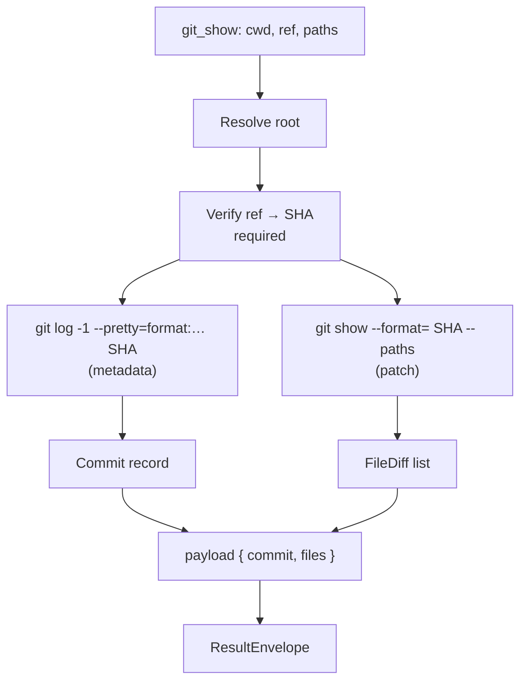

---

### `git_blame`

Returns per-line attribution (author, commit, timestamp) for one file, optionally restricted to a `lineStart`–`lineEnd`
range and optionally at a specific `ref`. Uses `--porcelain` output for parseability. The line range is validated
(`start >= 1`, `end >= start`); invalid ranges return a `RejectedArgument` error.

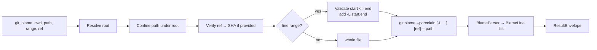

---

### `git_grep`

Searches tracked content, optionally at a historical `ref`, so you can grep a past revision without checking it out.
Always uses `-n -z` (line numbers, NUL-delimited).

- `fixedString` (default `true`) → literal search (`-F`).
- `fixedString: false` → Perl-compatible regex (`-P`), so `\s`, `\w`, `\d`, and bare quantifiers work the way callers
  expect.
- `ignoreCase` → `-i`; `maxCount` → per-file match cap (`-m`).

Exit code 1 ("no matches") is treated as success. If git was built without PCRE2, asking for regex returns a
`PcreUnavailable` error rather than silently looking like "no results".

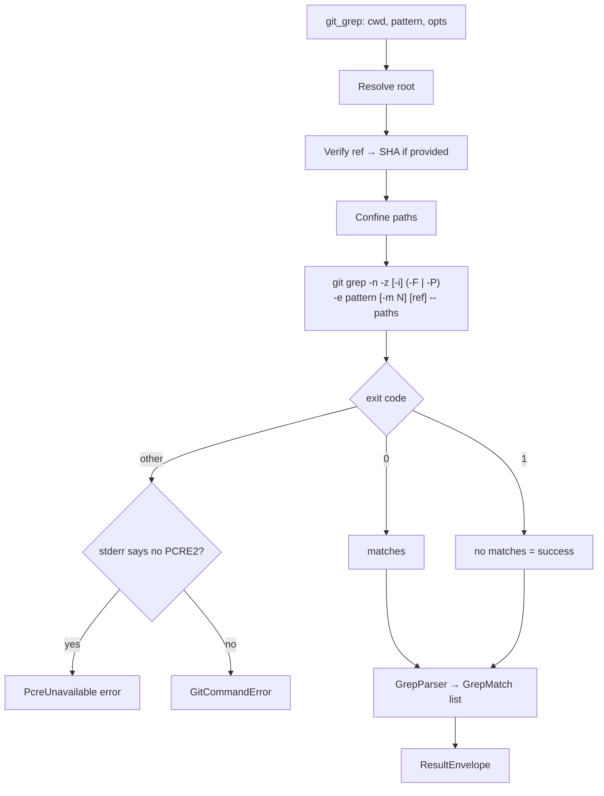

---

### `git_ls_files`

Lists tracked paths, optionally restricted to a subset of repo-relative paths. NUL-delimited output parsed into
entries. Useful for enumerating what's under version control before drilling in.

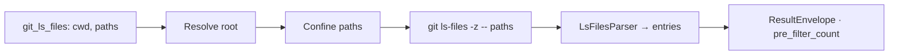

---

### `git_branch_list`

Lists local branches, and remotes when `includeRemote: true`. Uses `git for-each-ref` with a unit-separator (`\x1f`)
format so each branch yields its refname, HEAD marker, object name, upstream, and subject parsed into `Branch` records.

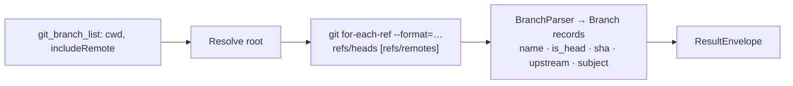

---

### `git_reflog`

Returns recent reflog entries (`maxCount`, default 50), each with `hash`, `short_hash`, `selector`, `subject`, `when`,
and a human `relative_time`. Useful for recovering lost work or following recent HEAD movement.

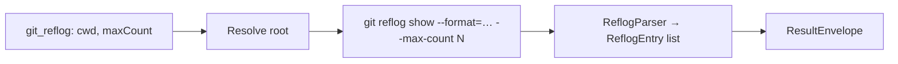

---

### `git_stash_list`

Lists stash entries with selector, subject, and timestamp via `%gd%x1f%gs%x1f%at`, parsed into `StashEntry` records.

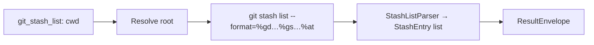

---

### `git_stash_show`

Returns the diff for a single stash (`index`, 0 = most recent) as a `DiffResult`, using the same two-pass
patch + `--numstat -z` assembly as `git_diff`. A negative index returns a `RejectedArgument` error.

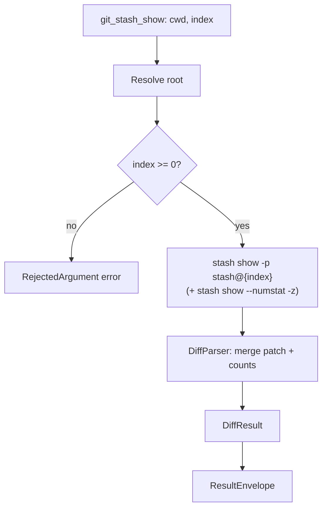

---

## The result envelope

Every collection-returning tool wraps its payload in this structure:

```jsonc
{
  "results": [ /* typed items: commits, file diffs, blame lines, … */ ],
  "count": 12,                 // results.length
  "pre_filter_count": 12,      // count before any post-filtering (when relevant)
  "filters_applied": {         // echo of which filters were in effect
    "author": "<redacted>",    // user-controlled values are redacted, not echoed
    "max_count": 50
  },
  "truncated": false,          // true if git output hit the 8 MB cap
  "repo_root": "/abs/path/to/repo",
  "error": null                // populated only on failure (see below)
}
```

On failure, `results` is a well-formed empty list and `error` carries a structured object:

```jsonc
{
  "results": [],
  "count": 0,
  "error": {
    "code": "RefNotFound",                  // stable, machine-readable
    "message": "ref not found; try git_branch_list or git_log",
    "detail": { "param": "ref" }            // never contains user data / paths
  }
}
```

### Error codes

| Code                | Meaning                                  |
|---------------------|------------------------------------------|
| `GitCheckError`     | Generic base error                       |
| `GitNotInstalled`   | `git` not found / failed to start        |
| `NotAGitRepository` | `cwd` is not inside a work tree          |
| `RefNotFound`       | A ref could not be resolved              |
| `AmbiguousRef`      | A ref resolved ambiguously               |
| `PathNotFound`      | A path does not exist                    |
| `PathOutsideRepo`   | A path escaped the repository root       |
| `RejectedArgument`  | An argument failed shape validation      |
| `GitTimeout`        | The subprocess exceeded the 30 s timeout |
| `GitCommandError`   | git exited non-zero for another reason   |
| `PcreUnavailable`   | Regex requested but git lacks PCRE2      |

Client-facing error detail is data-free (exit code, parameter name). The scrubbed git stderr tail is logged
server-side only, since it can echo user-controlled paths or refs.

---

## Security Model TL;DR

- TL;DR:
  - This server lets an AI assistant *read* your Git history but never *change* it, and it's built so that even a buggy or hostile assistant can't turn a "look" into damage.
  - Read-only by design, no shell to exploit, confined to your repo, and hardened against malicious repositories. The section below is the same story with the technical details.

- Still TL;DR, but with more info:
  - **It can only read.** Commands that alter a repo (commit, push, checkout, reset, delete) aren't in this server at all. There's no setting to flip; the dangerous verbs were simply never built.
  - **There's no shell to trick.** The assistant never gets a command line. It fills in a form (which tool, which file, which commit), and the server assembles the real `git` command itself. Old tricks like hiding `; rm -rf` inside a filename go nowhere, because nothing interprets them as commands.
  - **It stays inside your repo.** Every file path is pinned to the repository folder. Attempts to climb out of it, reach network shares, or touch hidden file streams are rejected.
  - **Every input is treated as suspect.** Branch and commit names are checked against the real repo before use, and nothing the assistant sends can be mistaken for a secret command-line option.
  - **Git itself is locked down.** Auto-running scripts (hooks), password prompts, and credential helpers are switched off, and the command runs in a stripped-down environment, so a booby-trapped repo can't hijack it.
  - **It can't run away.** Each call is capped at 30 seconds and 8 MB of output, then stopped: no runaway processes, no memory blowups.
  - **It doesn't leak.** Error messages and logs are scrubbed of your file names, search terms, and paths.

As is with all in-house security solutions: This is not perfect, and I might be unknowingly be re-inventing the wheel. But it's a best-effort type of thing. I'll gladly accept feedback and suggestions to improve it.

---

## Security model (long version)

The assistant never sees a shell and never builds a command line. Untrusted input: `cwd`, refs, paths, patterns, and
filter values is handled in stages:

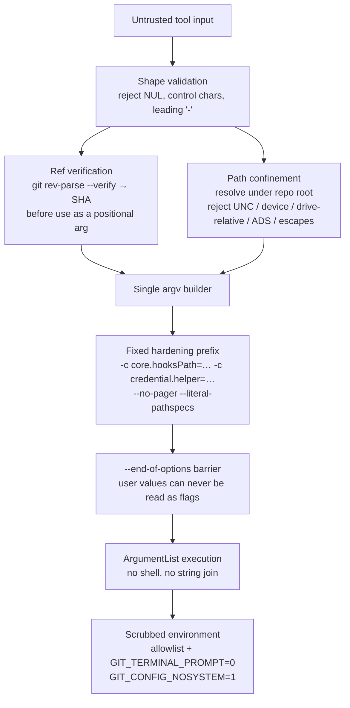

- **One argv producer.** Tools declare a typed `GitIntent`; a single `GitCommandBuilder` is the only code that
  serializes it to argv. It prepends fixed `-c` neutralizers (disable hooks, pager, fsmonitor, credential helpers,
  askpass, auto-gc) and inserts `--end-of-options` so no user-supplied value can be parsed as an option.
- **Refs are verified, not trusted.** Any ref is resolved to a SHA via `git rev-parse --verify --end-of-options <ref>`
  before it's used.
- **Paths are confined.** Each path is resolved under the repo root and rejected if it uses a UNC, device, or
  drive-relative prefix, an NTFS alternate data stream, or otherwise escapes the root. The result is a repo-relative
  POSIX pathspec placed after `--`.
- **No shell.** The subprocess is started with an explicit argument list, not a joined string, so shell
  meta-characters can't leak.
- **Scrubbed environment.** The child env is built from a small allowlist (`PATH`, locale vars, `HOME`, plus a few
  Windows essentials) with fixed git neutralizers added. Everything else is dropped.

---

## Logging

Structured JSON logs (allowlisted fields only, no user data) go to a rotating file, falling back to stderr if the file
can't be opened. stdout is reserved for the MCP protocol.

| Variable               | Purpose                                       | Default                                 |
|------------------------|-----------------------------------------------|-----------------------------------------|
| `MCP_GITOPS_LOG_FILE`  | Log file path                                 | `mcp-gitops.log` next to the executable |
| `MCP_GITOPS_LOG_LEVEL` | `TRACE`/`DEBUG`/`INFO`/`WARN`/`ERROR`/`FATAL` | `INFO`                                  |

Files rotate at 10 MB, keeping 5 backups. On shutdown the server writes a `server_stop` summary with session metrics
(call counts, cache hit rate, truncations, timeouts).

---

## Building from source

TODO: Add instructions to build on Windows, macOS, and Linux.

---

## Adding this server to Claude Code

The server is a .NET console app that speaks MCP over stdio. It needs `git` and the .NET 10 SDK/runtime on `PATH`.

Add an entry to your MCP configuration (e.g. `.mcp.json` at your project root, or via `claude mcp add`). On Windows:

```jsonc
{
  "mcpServers": {
    "git-ops": {
      "command": "c:\\path\\to\\RaccoonNinja.McpToolset.Server.GitOps.exe",
      "args": [],
      "env": {
        "MCP_GITOPS_LOG_FILE": "Z:\\logs\\mcp-gitops.log",
        "MCP_GITOPS_LOG_LEVEL": "INFO"
      }
    }
  }
}
```

> On macOS/Linux, drop the `.exe` suffix and use forward-slash paths.

### Verifying the connection

After adding the server, restart Claude Code and run `/mcp` (or `claude mcp list`) to confirm `git-ops` is connected.
The tools appear as `git_status`, `git_diff`, `git_log`, and so on. Each call needs an absolute `cwd` inside a git
repository. Claude Code supplies the working directory automatically.

> Quick note: This project follows the MCP protocol, so this tool should work with any AI agent.

---

## Project layout

```
RaccoonNinja.McpToolset.Server.GitOps/
├─ Program.cs            # stdio host bootstrap (logging → MCP wiring → sentinel → run)
├─ Tools/                # one class per MCP tool + ToolCommon (shared pipeline)
├─ Security/             # GitIntent, GitCommandBuilder, path/arg validation, env builder
├─ Repo/                 # repo-root resolution (cached) + ref verification
├─ Runner/               # hardened subprocess runner (timeout + output cap)
├─ Parsers/              # NUL/porcelain parsers → typed models
├─ Models/               # Commit, DiffResult, BlameLine, Branch, StashEntry, …
├─ Envelope/             # ResultEnvelope / ErrorEnvelope + filters builder
├─ Errors/               # error-code taxonomy + domain exceptions
└─ Logging/ · Metrics/   # allowlist JSON logging, stdout sentinel, session metrics
```

## Example of instructions to use this MCP

Below we have an example of instructions you can drop on a `CLAUDE.md` or similar, to tell the assistant to use this mcp
server.

```markdown
## Git operations

There is a GitOps MCP server registered as `git-ops`. Use its tools for all read-only git inspections.
Each tool takes an absolute `cwd` and returns structured JSON, so don't `cd` into the repo first and don't shell
out to `git` for anything the tools below already cover.

### Use these instead of shell `git`

| Instead of                                                              | Use                                                                                                      |
|-------------------------------------------------------------------------|----------------------------------------------------------------------------------------------------------|
| `git status`                                                            | `git_status`                                                                                             |
| `git diff`, `git diff --cached`, `git diff <a>..<b>`, `git diff --stat` | `git_diff` (mode picked by params: `staged`, `fromRef`/`toRef`, `statOnly`)                              |
| `git log ...`                                                           | `git_log` (filters: `author`, `since`, `until`, `grep`, `pickaxe`, `paths`, `ref`, `follow`, `maxCount`) |
| `git show <ref>`                                                        | `git_show`                                                                                               |
| `git blame <file>`                                                      | `git_blame` (supports `lineStart`/`lineEnd` and `ref`)                                                   |
| `git grep <pattern>`                                                    | `git_grep` (set `fixedString: false` for regex)                                                          |
| `git ls-files`                                                          | `git_ls_files`                                                                                           |
| `git branch`, `git branch -a`                                           | `git_branch_list` (set `includeRemote: true` for remotes)                                                |
| `git reflog`                                                            | `git_reflog`                                                                                             |
| `git stash list`                                                        | `git_stash_list`                                                                                         |
| `git stash show stash@{N}`                                              | `git_stash_show` (pass `index`)                                                                          |

### Rules

- Pass `cwd` as an absolute path. The server resolves the repo root itself; you don't need to be inside the repo or know its layout.
- Never `cd` and then run a git command for anything in the table above. The MCP call is the same regardless of the shell's current directory, and chaining `cd && git ...` defeats the point of having structured tools.
- Don't shell out to `git` via bash for any read-only operation the table covers, even for one-liners. The structured output saves a parse step and the error codes are machine-readable.
- Bash `git` is only acceptable for write operations (`commit`, `add`, `push`, `checkout`, `reset`, `merge`, `rebase`, `tag`, `fetch`, `pull`, etc.), since this server is read-only by design. -- However, check yours, the users, and the projects guidelines first before using any of the git write-operations commands.

### Reading the result envelope

Collection-returning tools wrap their payload in `{ results, count, filters_applied, truncated, repo_root, error }`.

- Check `error` first. If it's `null`, work with `results`. If not, branch on `error.code` (stable values like `RefNotFound`, `PathOutsideRepo`, `RejectedArgument`, `GitTimeout`, `PcreUnavailable`), not on the message text.
- `truncated: true` means git's output hit the 8 MB cap. Narrow the query (lower `maxCount`, restrict `paths`, tighten `since`/`until`) and call again rather than guessing what got cut.
- `GitTimeout` means the call ran past 30 s. Same fix: narrow the query.

### Common patterns

- "What changed?": `git_status` for the working tree, `git_diff` with `staged: true` for the index, `git_diff` with `fromRef`/`toRef` between commits.
- "Who wrote line N?": `git_blame` with `lineStart` and `lineEnd` both set to N.
- "When was this string added or removed?": `git_log` with `pickaxe: "<string>"`.
- "Find usages of X in the repo": `git_grep` with `pattern: "X"` (set `fixedString: false` if X is a regex).
- "Find usages of X as of commit Y": `git_grep` with `pattern: "X"` and `ref: "Y"`.
- "What did commit X change?": `git_show` with `ref: "X"`.
- "What's on this branch that isn't on main?": `git_log` with `ref: "main..feature-branch"` style ref expression (verified via `rev-parse` before use).

```